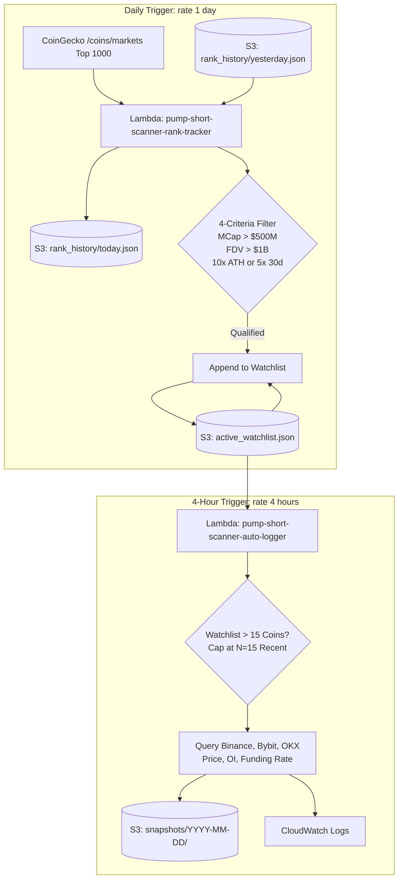

# Pump Short Scanner

A specialized cryptocurrency scanner designed to detect heavily pumped crypto assets that meet rigorous market capitalization, fully diluted valuation (FDV), and price-multiple thresholds for short-side research.

> **Status**: 🧪 **Serverless 24/7 Forward-Testing Active** (AWS Lambda + Amazon S3 + EventBridge every 4 hours).

---

## 🎯 Purpose & Strategy Overview

The primary objective of `pump-short-scanner` is to scan the crypto market for extreme parabolic pump events where high valuations and stretched price multiples create high-probability mean-reversion short opportunities.

### The 4 Core Filter Criteria (`config.py`):
1. **Min Market Cap**: $\ge \$500,000,000$ (Ensures sufficient liquidity).
2. **Min Fully Diluted Valuation (FDV)**: $\ge \$1,000,000,000$.
3. **ATH Multiple Threshold**: $\ge 10\times$ multiple from base/ATL with active ATH proximity (OR)
4. **30-Day Multiple Threshold**: $\ge 5\times$ multiple (+400% gain) over the last 30 days.

---

## 🚀 Getting Started Locally

### Prerequisites
- Python 3.10+
- `pip`

### Installation
1. Clone the repository:
   ```bash
   git clone https://github.com/dhanrajgupta2736/pump-short-scanner.git
   cd pump-short-scanner
   ```
2. Install dependencies:
   ```bash
   pip install -r requirements.txt
   ```

---

## 🖥️ Running the Tools

### 1. Market Scanner (`main.py`)
Fetches real-time CoinGecko market data across the **Top 1000 coins by market cap** to evaluate the 4-criteria filter and surface liquid 30-day gainers ($\ge \$1\text{M}$ volume floor):
```bash
python main.py
```

### 2. Multi-Exchange Forward-Test Auto-Logger (`scanner/auto_logger.py`)
Fetches live **Price**, **Open Interest (OI)**, and **Funding Rate** across **Binance USDT-M Futures**, **Bybit Linear Futures (v5)**, and **OKX Perpetual Swaps (v5)** using direct free public endpoints (no API keys required):
```bash
# Run locally (logs to data/oi_funding_manual_log.csv):
python scanner/auto_logger.py

# Or run with S3 upload:
set LOG_BUCKET_NAME=pump-short-scanner-logs-dhanraj-7938
python scanner/auto_logger.py
```

> [!TIP]
> **Why Direct Exchange APIs over Coinglass?**
> We deliberately chose direct public exchange APIs (Binance, Bybit, OKX) over aggregators like Coinglass. Coinglass API is a paid product (~$29/month minimum), whereas the exchanges themselves expose raw, real-time Open Interest and Funding Rate data for free.

> [!NOTE]
> **Data Retention Limitation**: Exchange public endpoints report **current live values** on each run. They cannot backfill historical OI older than 30 days.

---

## ☁️ Serverless 24/7 AWS Deployment

The system runs completely serverless on AWS across two coordinated jobs, incurring **$0.00 / month** on the AWS Free Tier.



### Deployed AWS Resources:
- **AWS Region**: `ap-south-1` (Asia Pacific - Mumbai)
- **S3 Bucket**: `pump-short-scanner-logs-dhanraj-7938` (Private, Block Public Access enabled)
  - `active_watchlist.json`: Single source of truth for active forward-test candidates.
  - `rank_history/YYYY-MM-DD.json`: Daily CoinGecko top-1000 market snapshots (4 pages $\times$ 250).
  - `snapshots/YYYY-MM-DD/snapshot_YYYYMMDD_HHMMSS.csv`: 4-hourly derivative logs.
- **Job 1 Lambda**: `pump-short-scanner-rank-tracker`
  - Runtime: `Python 3.12` | Memory: `128 MB` | Timeout: `300s`
  - Handler: `rank_tracker.lambda_handler`
  - Schedule: `rate(1 day)` via EventBridge (`pump-short-scanner-rank-tracker-schedule`)
- **Job 2 Lambda**: `pump-short-scanner-auto-logger`
  - Runtime: `Python 3.12` | Memory: `128 MB` | Timeout: `60s`
  - Handler: `auto_logger.lambda_handler`
  - Schedule: `rate(4 hours)` via EventBridge (`pump-short-scanner-auto-logger-schedule`)
- **IAM Role**: `pump-short-scanner-lambda-role` (Scoped strictly to `s3:GetObject`, `s3:PutObject`, and `s3:ListBucket` on the bucket + CloudWatch Logs)

### Scope Realignment & Historical Trade Analysis (Top 1000 vs. Top 200):
Empirical analysis of our 8 original trade-history assets (`DEXE`, `RAVE`, `LAB`, `BILL`, `BEAT`, `VELVET`, `CYS`, `AKE`) revealed two critical findings:
1. **Massive Post-Pump Mean Reversion**: At their historical pump peaks, all 8 assets reached valuations high enough to briefly enter the Top 200 (e.g. `RAVE` hit $7.6B, `DEXE` hit $1.76B, `VELVET` hit $578M). However, once the pump concluded, they crashed by **85% to 99%**, causing 7 of the 8 to sit in the **Rank 350 to 800** bracket today.
2. **Flash Pump Window Risks**: Several parabolic pumps (e.g. `RAVE` and `CYS`) peaked and began reversing within **24 to 48 hours**. A narrow Top-200 net risks missing coins that enter and exit the Top 200 between daily runs.
By scanning the entire **Top 1000** (matching `main.py`), Job 1 detects candidate moves earlier in their ascent and retains them on the radar throughout their cycle.

### Managing the Active Watchlist:
`active_watchlist.json` stores all candidates currently tracked for derivative logging.
- **Automated**: Job 1 checks daily for coins newly entering CoinGecko's Top 200 that meet the 4-criteria filter, appending them automatically.
- **Manual Trades**: Manual candidates (such as active live trades like `AKEUSDT`) can be directly added to `active_watchlist.json` in S3.
- **Execution Safeguard ($N = 15$)**: If the watchlist expands beyond 15 coins, `auto_logger.py` logs a clear warning and caps processing at the 15 most recently added candidates to guarantee completion well within Lambda's 60-second execution timeout.

### How to Check Logs & Data:
1. **View Active Watchlist**:
   ```bash
   aws s3 cp s3://pump-short-scanner-logs-dhanraj-7938/active_watchlist.json -
   ```
2. **List Daily Rank Snapshots**:
   ```bash
   aws s3 ls s3://pump-short-scanner-logs-dhanraj-7938/rank_history/
   ```
3. **List 4-Hourly Derivative Snapshots**:
   ```bash
   aws s3 ls s3://pump-short-scanner-logs-dhanraj-7938/snapshots/ --recursive
   ```
4. **Download & View Latest Snapshot**:
   ```bash
   aws s3 cp s3://pump-short-scanner-logs-dhanraj-7938/snapshots/YYYY-MM-DD/<snapshot_file>.csv -
   ```
5. **Check CloudWatch Logs**:
   ```bash
   aws logs tail /aws/lambda/pump-short-scanner-rank-tracker --follow
   aws logs tail /aws/lambda/pump-short-scanner-auto-logger --follow
   ```

---

## 📊 Current Status & Roadmap
- [x] Initial repository setup & Git workflow
- [x] CoinGecko free public API client with Top 1000 pagination
- [x] 4-criteria filtering engine with active ATH gating
- [x] Tradeable volume floor on Top 30-Day Gainers ($1M USD)
- [x] Multi-Exchange Forward-Test Auto-Logger (`Binance`, `Bybit`, `OKX`)
- [x] Serverless AWS 24/7 Deployment (Lambda + S3 + EventBridge every 4 hours)
- [x] Dynamic S3 Watchlist & Daily CoinGecko Top-200 Rank Tracker (Job 1)
- [x] 28-Day Empirical Forward-Test Dataset & Trajectory Analysis (Aug 23 – Sep 20, 2026)
- [ ] Automated OI rollover and top-detection alerts
