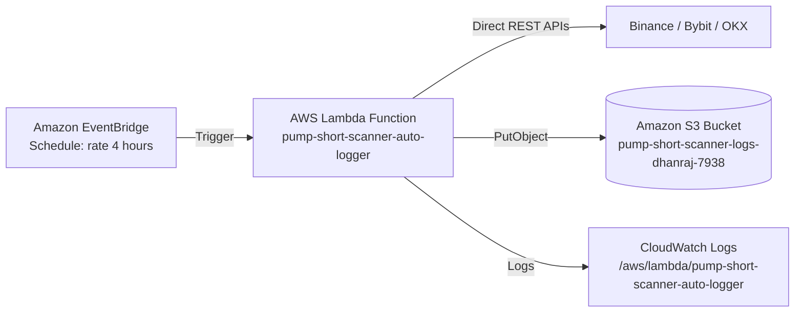

# Pump Short Scanner

A specialized cryptocurrency scanner designed to detect heavily pumped crypto assets that meet rigorous market capitalization, fully diluted valuation (FDV), and price-multiple thresholds for short-side research.

> **Status**: 🧪 **Serverless 24/7 Forward-Testing Active** (AWS Lambda + Amazon S3 + EventBridge every 4 hours).

---

## 🎯 Purpose & Strategy Overview

The primary objective of `pump-short-scanner` is to scan the crypto market for extreme parabolic pump events where high valuations and stretched price multiples create high-probability mean-reversion short opportunities.

### The 4 Core Filter Criteria (`config.py`):
1. **Min Market Cap**: $\ge \$500,000,000$ (Ensures sufficient liquidity).
2. **Min Fully Diluted Valuation (FDV)**: $\ge \$1,000,000,000$.
3. **ATH Multiple Threshold**: $\ge 10\times$ multiple from base/ATL with active ATH proximity (OR)
4. **30-Day Multiple Threshold**: $\ge 5\times$ multiple (+400% gain) over the last 30 days.

---

## 🚀 Getting Started Locally

### Prerequisites
- Python 3.10+
- `pip`

### Installation
1. Clone the repository:
   ```bash
   git clone https://github.com/dhanrajgupta2736/pump-short-scanner.git
   cd pump-short-scanner
   ```
2. Install dependencies:
   ```bash
   pip install -r requirements.txt
   ```

---

## 🖥️ Running the Tools

### 1. Market Scanner (`main.py`)
Fetches real-time CoinGecko market data across the **Top 1000 coins by market cap** to evaluate the 4-criteria filter and surface liquid 30-day gainers ($\ge \$1\text{M}$ volume floor):
```bash
python main.py
```

### 2. Multi-Exchange Forward-Test Auto-Logger (`scanner/auto_logger.py`)
Fetches live **Price**, **Open Interest (OI)**, and **Funding Rate** across **Binance USDT-M Futures**, **Bybit Linear Futures (v5)**, and **OKX Perpetual Swaps (v5)** using direct free public endpoints (no API keys required):
```bash
# Run locally (logs to data/oi_funding_manual_log.csv):
python scanner/auto_logger.py

# Or run with S3 upload:
set LOG_BUCKET_NAME=pump-short-scanner-logs-dhanraj-7938
python scanner/auto_logger.py
```

> [!TIP]
> **Why Direct Exchange APIs over Coinglass?**
> We deliberately chose direct public exchange APIs (Binance, Bybit, OKX) over aggregators like Coinglass. Coinglass API is a paid product (~$29/month minimum), whereas the exchanges themselves expose raw, real-time Open Interest and Funding Rate data for free.

> [!NOTE]
> **Data Retention Limitation**: Exchange public endpoints report **current live values** on each run. They cannot backfill historical OI older than 30 days.

---

## ☁️ Serverless 24/7 AWS Deployment

The forward-test logger runs completely serverless on AWS without any always-on servers, incurring **$0.00 / month** on the AWS Free Tier.



### Deployed AWS Resources:
- **AWS Region**: `ap-south-1` (Asia Pacific - Mumbai)
- **S3 Bucket**: `pump-short-scanner-logs-dhanraj-7938` (Private, Block Public Access enabled)
  - Object Key Format: `snapshots/YYYY-MM-DD/snapshot_YYYYMMDD_HHMMSS.csv`
- **Lambda Function**: `pump-short-scanner-auto-logger`
  - Runtime: `Python 3.12` | Memory: `128 MB` | Timeout: `60s`
  - Handler: `auto_logger.lambda_handler`
  - Environment Variable: `LOG_BUCKET_NAME=pump-short-scanner-logs-dhanraj-7938`
- **IAM Role**: `pump-short-scanner-lambda-role` (Scoped strictly to `s3:PutObject` on this bucket + CloudWatch Logs)
- **EventBridge Rule**: `pump-short-scanner-auto-logger-schedule` (Schedule: `rate(4 hours)`)

### How to Check Logs & Data:
1. **List S3 Snapshots**:
   ```bash
   aws s3 ls s3://pump-short-scanner-logs-dhanraj-7938/snapshots/ --recursive
   ```
2. **Download & View a Snapshot**:
   ```bash
   aws s3 cp s3://pump-short-scanner-logs-dhanraj-7938/snapshots/2026-08-23/snapshot_20260823_134613.csv -
   ```
3. **Check CloudWatch Logs**:
   ```bash
   aws logs tail /aws/lambda/pump-short-scanner-auto-logger --follow
   ```

### 📝 Updating the Candidate List:
Currently, the forward-test candidate list is defined in `FORWARD_TEST_CANDIDATES` within [`scanner/auto_logger.py`](file:///c:/Users/HP/Desktop/pump-short-scanner/scanner/auto_logger.py). When you identify new candidates from `main.py`:
1. Update `FORWARD_TEST_CANDIDATES` in `scanner/auto_logger.py`.
2. Repackage and update the Lambda function code:
   ```bash
   # Package
   python -c "import os, shutil, subprocess, zipfile; pkg='lambda_pkg'; os.makedirs(pkg, exist_ok=True); subprocess.run(['pip', 'install', '--platform', 'manylinux2014_x86_64', '--target', pkg, '--only-binary=:all:', '--python-version', '3.12', 'requests']); shutil.copy('scanner/auto_logger.py', os.path.join(pkg, 'auto_logger.py')); shutil.make_archive('function', 'zip', pkg); shutil.rmtree(pkg)"
   # Deploy update
   aws lambda update-function-code --function-name pump-short-scanner-auto-logger --zip-file fileb://function.zip --region ap-south-1
   ```

---

## 📊 Current Status & Roadmap
- [x] Initial repository setup & Git workflow
- [x] CoinGecko free public API client with Top 1000 pagination
- [x] 4-criteria filtering engine with active ATH gating
- [x] Tradeable volume floor on Top 30-Day Gainers ($1M USD)
- [x] Multi-Exchange Forward-Test Auto-Logger (`Binance`, `Bybit`, `OKX`)
- [x] Serverless AWS 24/7 Deployment (Lambda + S3 + EventBridge every 4 hours)
- [ ] Forward-test data collection across exchanges (1–2 weeks)
- [ ] Cross-exchange OI/funding divergence analysis
