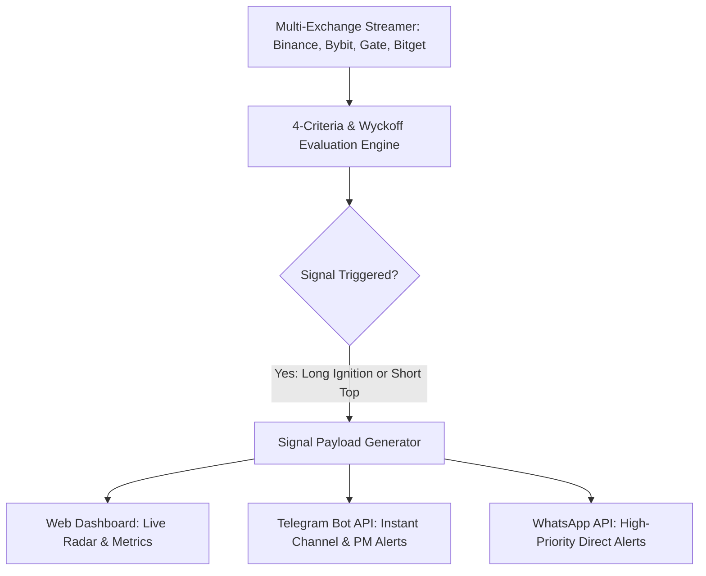
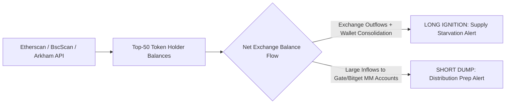

# Master Implementation Roadmap: Next-Gen Squeeze Intelligence Platform

This blueprint outlines the phased implementation plan to transition our validated quantitative research into an automated, multi-channel trading and intelligence platform.

---

## Strategic Milestone: The Post-BTW Crash Trigger

We initiate active development of Phase 1 once **BTW completes its crash cycle and stabilizes below `$0.10`** (or completes its Primary Target 1/2 drawdown). This preserves our focused attention on monitoring the BTW short trajectory while preparing the code architecture for deployment.

---

## Phase 1: Real-Time Intelligence Dashboard & Multi-Channel Alerting



### 1.1 Web Scanner Dashboard
* **Design & Aesthetics**: Sleek, high-contrast dark mode dashboard built with modern typography (Inter/JetBrains Mono), glassmorphic metric cards, and responsive real-time charts.
* **Core Views**:
  * **Squeeze Radar Table**: Displays all tracked tokens ranked by Squeeze Risk Score (Float %, FDV, 24h Volume / Baseline Vol, OI/MCap ratio).
  * **Funding Heatmap**: Cross-exchange matrix showing live funding rates across Binance, Bybit, Bitget, and Gate.io with color-coded divergence tags.
  * **Live Telemetry Panels**: Real-time tick charts comparing Mark Price vs Open Interest (Coins & USD) vs 24h Volume decay.
  * **Signal History & Performance Log**: Automated tracking of entry price, current PnL, and milestone hit rates (TP1, TP2, TP3).

### 1.2 Multi-Channel Alerting (Telegram & WhatsApp)
* **Integrations**:
  * **Telegram**: Dedicated Telegram Bot utilizing the Telegram Bot API (`sendMessage` with rich Markdown/HTML formatting and inline buttons for quick charting links).
  * **WhatsApp**: Automated delivery via Twilio API for WhatsApp or Meta Cloud WhatsApp Business API for critical high-conviction alerts.
* **The Comprehensive Signal Payload Anatomy**:
  Every alert is structured to deliver instant, actionable execution intelligence:

```
🚨 [PUMP-SHORT-SCANNER] SHORT EXHAUSTION SIGNAL: $BTW
━━━━━━━━━━━━━━━━━━━━━━━━━━━━━━━━━━
📊 SIGNAL SUMMARY:
• Asset: BTW/USDT (Binance / Gate / Bitget)
• Current Price: $1.4410
• Signal Type: Phase E Distribution / Volume Exhaustion Top
• FDV Valuation: $14.41 Billion (Above 75th Percentile Peer Ceiling)
• Circulating Float: 27.1% (Low-Float Cartel Pattern Match)

📈 DERIVATIVES & TELEMETRY:
• 4h Volume Decay: -97.1% from peak ($81.4M -> $2.3M)
• Open Interest: 103.4M BTW (-42% contract unwinding)
• Funding Rates:
  - Binance: +0.0050%
  - Gate.io: +0.0036%
  - Bitget:  +0.0222%
• Order Book Depth (+/- 2%): Bids: $26.6k vs Asks: $34.8k (Thin Vacuum)

🎯 EXECUTION STRATEGY:
• Recommended Position: SHORT (2x to 3x Isolated Leverage)
• Entry Zone: $1.15 - $1.25 (Dead-Cat Retest Zone)
• Stop-Loss / Invalidation: $1.3100 (4h close above shelf)
• Liquidation Safety Buffer: $3.50+ (FDV > $35B)
• Take-Profit Targets:
  - TP1: $0.8650 (+25% gain) -> Move SL to Breakeven
  - TP2: $0.5500 (+50% gain) -> Take 50% profit
  - TP3: $0.1200 (+89% gain) -> Full Cartel Origin Target
━━━━━━━━━━━━━━━━━━━━━━━━━━━━━━━━━━
```

---

## Phase 2: On-Chain Flow Intelligence (Whale & Starvation Tracker)

Integrating on-chain balance and flow metrics gives us dual-directional edge:



### 2.1 For Longs (The Ignition Starvation Signal)
* **Metrics Tracked**:
  * Exchange Reserve Depletion: Tracking net token outflows from Gate.io, Bitget, and MEXC deposit hot wallets into private unlabelled addresses.
  * Holder Concentration Index: Percentage of circulating supply held by the top 10 non-exchange wallets.
  * Supply Starvation Ratio: Ratio of resting exchange ask depth vs total circulating tokens.

### 2.2 For Shorts (The Distribution Prep Signal)
* **Metrics Tracked**:
  * Whale-to-Exchange Deposit Spikes: Sudden multi-million token transfers from cartel creator/vesting wallets into centralized exchange deposit addresses during a parabolic run.
  * DEX Liquidity Pulls: Removal of LP tokens or depth from Uniswap / PancakeSwap prior to centralized exchange dumps.

---

## Phase 3: Cross-Exchange Funding Fee & Arbitrage Scanner (Parallel)

A dedicated, non-directional cash flow generator running continuously in parallel:

```
[Binance Futures: -2.0% Funding] <─── SPREAD: 1.5% ───> [Bybit Linear: -0.5% Funding]
               │                                                      │
         LONG $10,000                                          SHORT $10,000
               │                                                      │
               └─────────> NET DELTA EXPOSURE = $0.00 <───────────────┘
                           DAILY CASH YIELD = +9.0% ($900/day)
```

### 3.1 The Arbitrage Engine Features
1. **Live Funding Spread Matrix**: Continuously scans every perpetual contract across Binance, Bybit, Bitget, OKX, and Gate.io.
2. **Instant Spread Alerts**: Triggers high-priority notifications whenever:
   $$\text{Spread} = |\text{Funding}_{\text{Exchange A}} - \text{Funding}_{\text{Exchange B}}| \ge 1.0\% \text{ per settlement}$$
3. **Execution Calculator**:
   * Computes exact capital allocation per leg.
   * Displays basis risk margin buffer requirements to prevent wick liquidations.
   * Verifies settlement timestamp synchronization between exchanges.
4. **Spot-Perp Cash & Carry Module**:
   * Scans for deeply positive funding (+0.2% to +0.5%) where holding Spot on Gate.io and 1x Short Perp on Binance yields risk-free annualized APYs exceeding 100%+.

---

## Architectural Stack & Infrastructure

| Component | Technology | Rationale |
| :--- | :--- | :--- |
| **Backend & Ingestion** | Python 3.12 + FastAPI + WebSockets | High-concurrency async streaming for live order books and funding updates |
| **Data Persistence** | PostgreSQL / TimescaleDB + Amazon S3 | High-frequency time-series logging for OI, funding rates, and on-chain balances |
| **Alerting Infrastructure** | Telegram Bot API + Twilio WhatsApp API | Redundant, instant push notifications directly to mobile devices |
| **Frontend Dashboard** | Modern Vanilla CSS / React / Vite | Ultra-fast load times, glassmorphic dark-mode design, zero unnecessary bloat |
| **24/7 Serverless Automation** | AWS Lambda + EventBridge | Zero-server maintenance, 100% uptime, zero operational overhead |

---

## Summary Action Plan

1. **Now**: Let the BTW short trade play out through its crash targets toward `$0.10`.
2. **Next**: Implement the **Phase 1 Scanner Dashboard + Telegram/WhatsApp Alerting Engine**.
3. **Then**: Layer on the **On-Chain Flow Intelligence** and the **Funding Arbitrage Engine** in parallel.
